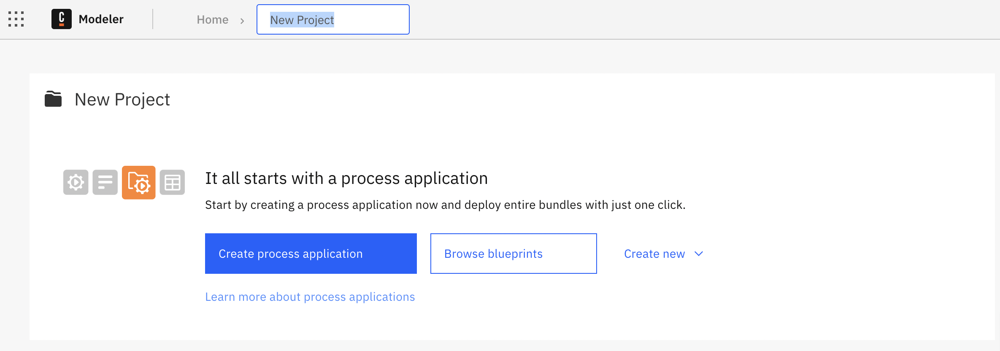
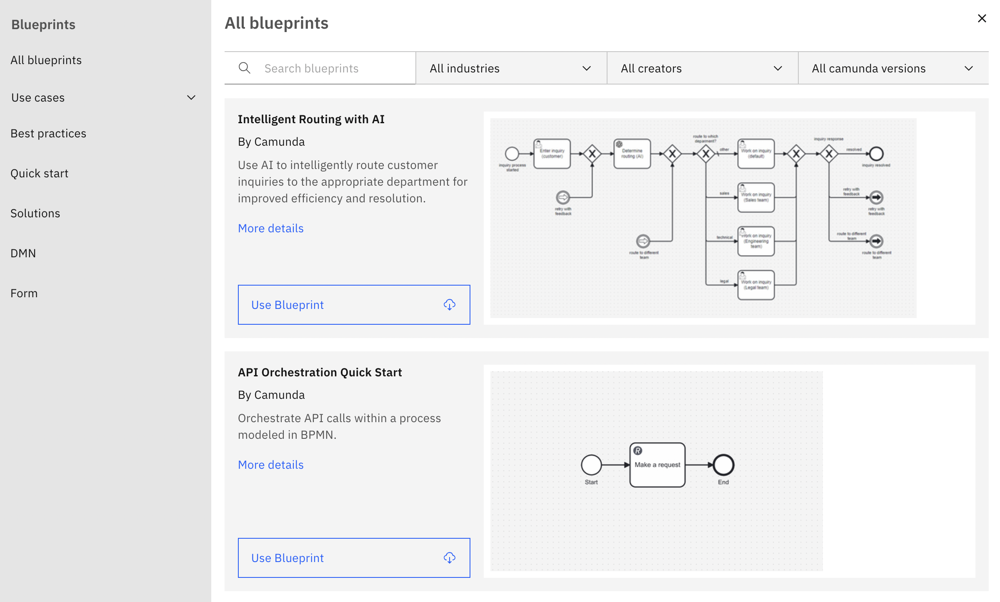
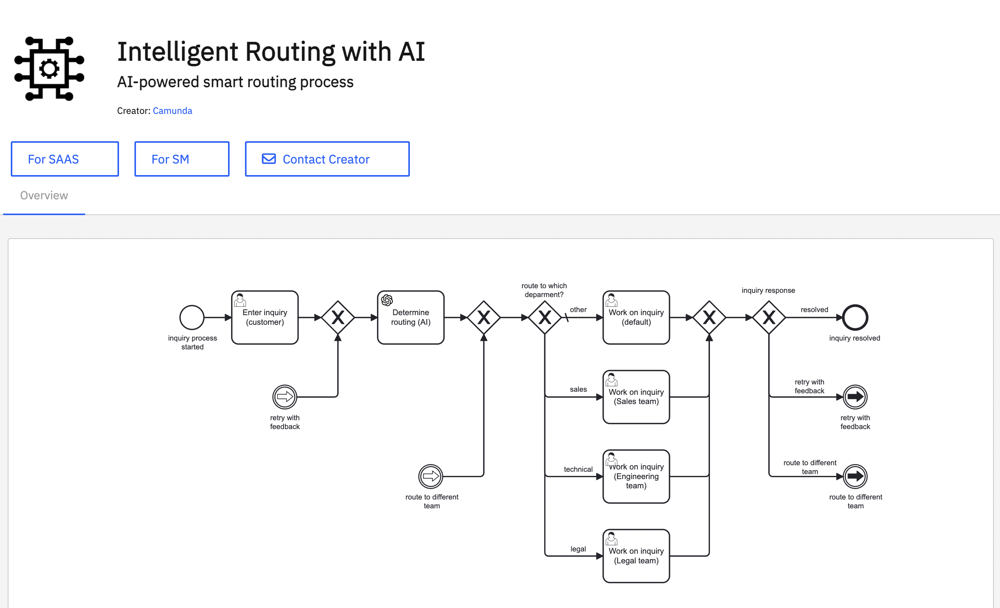

Camunda 8 only

Design and implement your first diagram using Web Modeler, a component of Camunda. Web Modeler also allows you to create BPMN diagrams, DMN diagrams, and forms.

To launch Web Modeler, follow the steps below:

1. After [creating an account and logging in](/guides/create-account.md) to Camunda, you are automatically taken to Web Modeler. Navigate between the components by clicking the square-shaped **Camunda components** icon in the top left corner of the page.
2. Select **Create new project** to create a new project and store diagrams.
   
3. Name your diagram. You can go back and change the name any time by clicking on the project name and **Edit name**.
4. Select **Browse blueprints** to open the blueprints dialog and view blueprints for various use cases as a starting point for your first diagram. Open these blueprints by selecting **Use blueprint**, which will download the blueprint into the project and open it in the diagram screen. Alternatively, click **Create new > BPMN diagram** to create a blank BPMN diagram.
   
5. While browsing blueprints, you can also open the details of a specific blueprint by selecting **More details**. This opens a new tab in the [Camunda Marketplace](/components/modeler/web-modeler/camunda-marketplace.md). Here, you can have a closer look at the diagram, and open it in SaaS or Self-Managed.

